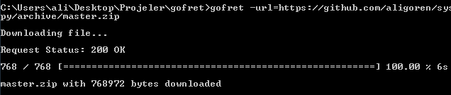
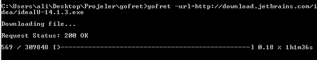

#Gofret Download Manager

Gofret is a Download Manager written in Go.

[Download](https://github.com/aligoren/gofret/raw/master/build/gofret.exe)

Gofret, [wget](http://www.gnu.org/software/wget/) like a download manager. But simple and amateur.

Gofret using the go's [pb](https://github.com/cheggaaa/pb) library.

**Gofret Version 0.1**

#Build

Install **pb** library

~~~~{.shell}
go get github.com/cheggaaa/pb
~~~~

After install:

~~~~{.shell}
go build -o gofret main.go // linux, unix like systems
go build -o gofret.exe main.go // for windows
~~~~

#Usage

####After Build:

~~~~{.shell}
./gofret -url=https://somesite.com/somefile.zip
~~~~

####Help

~~~~{.shell}
./gofret -help
~~~~

####Version

~~~~{.shell}
./gofret -version
~~~~